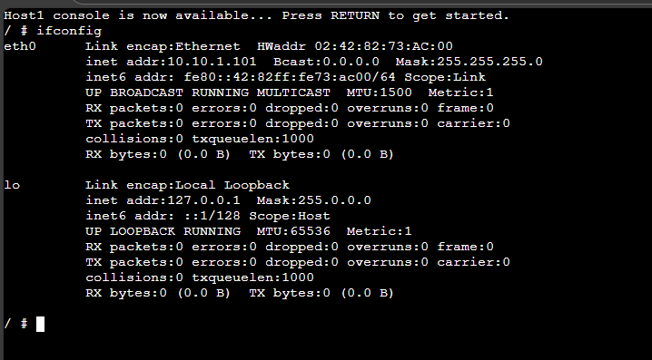
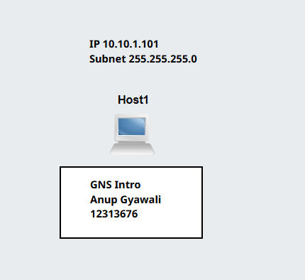

# Week 01: Introduction to Internetworking
## Task 1: Introduction to GNS3 Basics
## Outputs
1. GNS3 File \
[GNS3-Basics](/Gns3-files/GNS3-Intro-12313676.gns3project) 

2. Screenshot of Network \
 

3. Screenshot of console showing IP Address \
 

4. Commands learned in this tutorial \
   cd - to change directory \
   cd .. - to go to previous directory \
   cd / - to move into root diorectory \
   ip address - to view ip address \
   ifconfig - to view the ip address \
   

