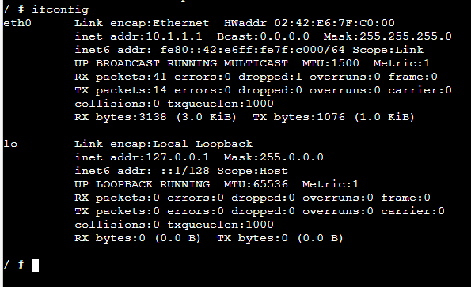
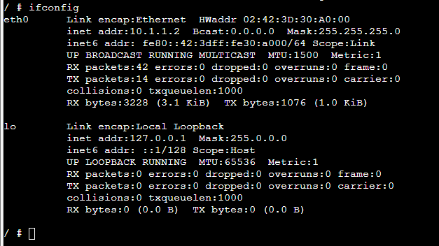
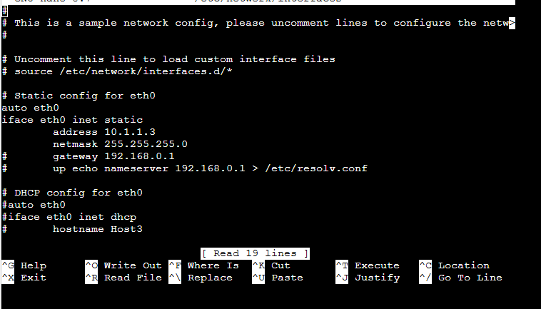
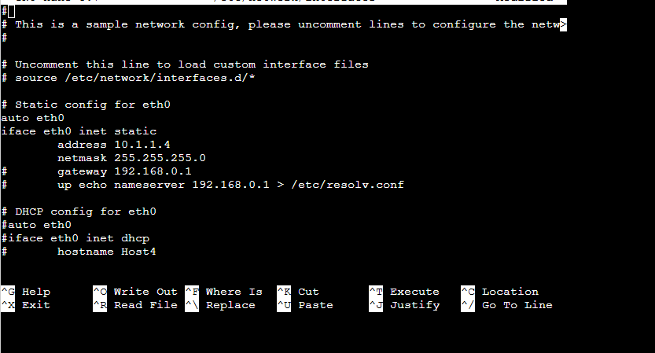
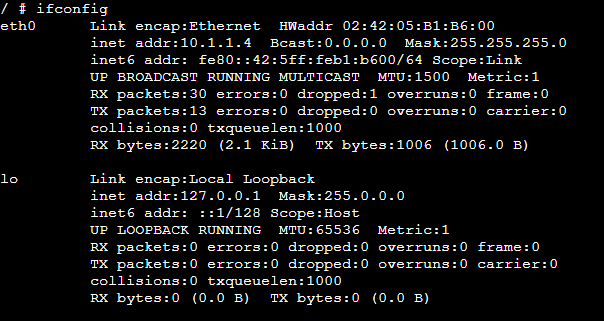
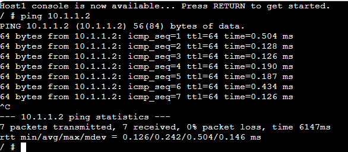
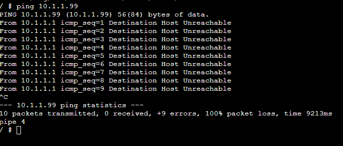
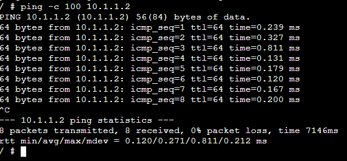

# Week 02: Encapsulation and Decapsulation

## Task 1: Setting Static IP Addresses
## Outputs
1. GNS3 File \
[GNS3-Setting-IP](Setting-IP-12313676.gns3project)

2. Network Diagram \

3. IP Address of Hosts 

**Host 1 and Host 2** \
The IP address for Host1 and Host2 are assigned manually from the configure menu in GNS3 by removing the # from some commands.

**Host 1** 

 

**Host 2**

 

**Host 3** 

The IP for Host3 is assigned using command from terminal 
The IP Configuration gets erased upon restart of the linux host.

 

**Host 4** 

The IP is assigned via terminal. Open host4 terminal and edit the configuration file *interfaces* located in /etc/network directory.
Used text editor nano to edit the configuration file. \
The IP assigned is fixed and the restart doesnt removed the IP. 

 

 

## Task 2: Testing Network Connectivity and Delay with Ping

## Outputs

1. Ping command output \

2. Ping command and output to a wrong IP \

3. Ping command (and output) when limiting the count, setting the data size and interval to non-default values.

