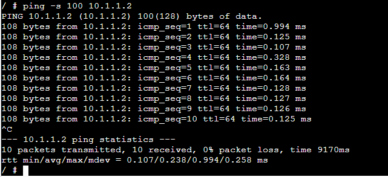
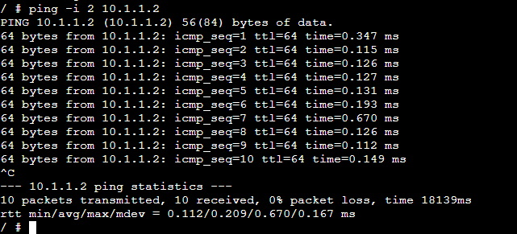

# Week 02: Encapsulation and Decapsulation

## Task 1: Setting Static IP Addresses
## Outputs
1. GNS3 File \
[GNS3-Setting-IP](Gns3-files/Setting-IP-12313676.gns3project)

2. Network Diagram \

3. IP Address of Hosts 

**Host 1 and Host 2** \

**Host 1** 

 

**Host 2**

 

**Host 3** 

 

**Host 4** 

 

## Testing Results – Task 1 
Each of the four Linux hosts was checked using the `ip address show` command to confirm their assigned IP addresses. The two hosts configured through the GNS3 Configure menu displayed their static IPs correctly after startup. The third host, configured by editing `/etc/network/interfaces` and reloading the interface with `ifdown eth0` and `ifup eth0`, successfully applied the new static IP. The fourth host, configured using the `ip address add` command, immediately showed the assigned IP. All hosts had valid IP addresses within the selected subnet, confirming that all three configuration methods worked as intended.

## Task 2: Testing Network Connectivity and Delay with Ping

## Outputs

1. Ping command output \

2. Ping command and output to a wrong IP \

3. Ping command (and output) when limiting the count, setting the data size and interval to non-default values.

Data size:

Limiting count: 

interval:

## Testing Results – Task 2 (Ping Connectivity and Delay)
Ping tests were performed between hosts to verify connectivity and measure round‑trip time (RTT). A basic ping from host A to host B returned multiple successful replies with stable RTT values, confirming reachability. Pinging a non-existent IP address resulted in 100% packet loss, demonstrating how ping reports unreachable destinations. Additional tests using options such as `-c`, `-i`, and `-s` showed how changing the count, interval, and packet size affected the frequency and size of ICMP requests, as well as the timing of responses. All results matched expected ping behaviour.

## Reflections
This week improved my understanding of multiple ways to configure static IP addresses in Linux, including persistent configuration through `/etc/network/interfaces` and temporary assignment using the `ip` command. Reloading the interface helped reinforce how Linux applies network settings. The ping exercises strengthened my ability to interpret RTT, packet loss, and how command-line options influence network testing. Overall, this task increased my confidence in basic network configuration and troubleshooting in GNS3.

## Notes on Key Concepts Learned
Key concepts learned include three approaches to static IP configuration (GNS3 Configure menu, editing `/etc/network/interfaces`, and using `ip address add`), the difference between persistent and non-persistent IP assignments, and the need to reload interface settings when editing configuration files. I also learned how ping works, how to interpret RTT and packet loss, and how options like count, interval, and packet size affect ping behaviour.

