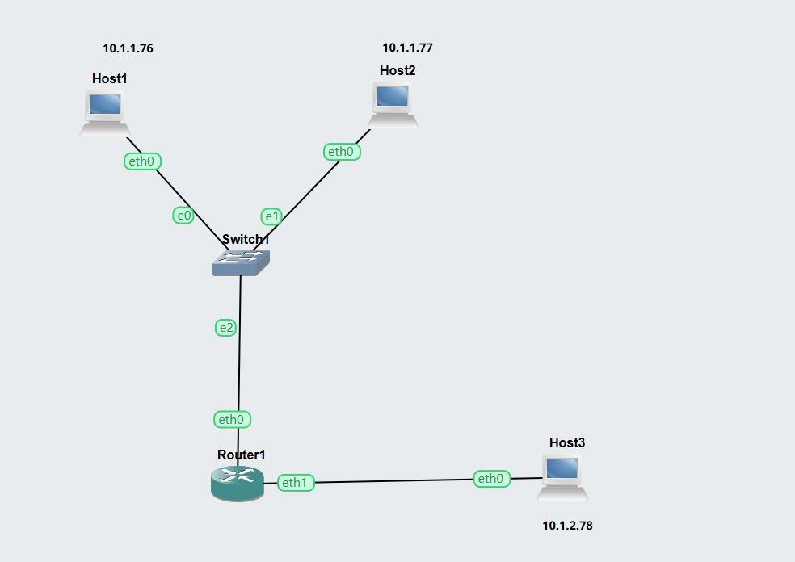
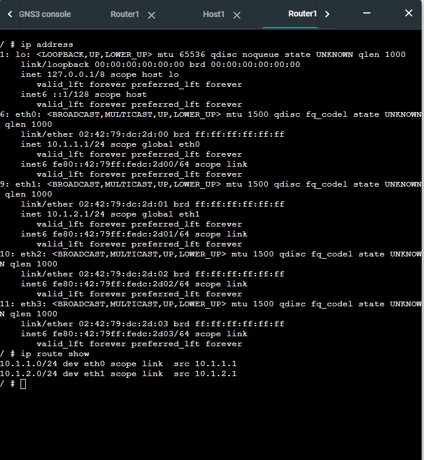
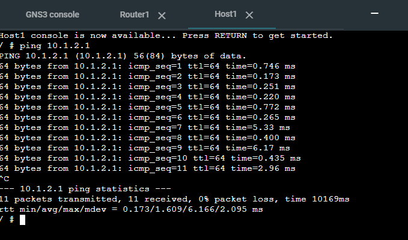
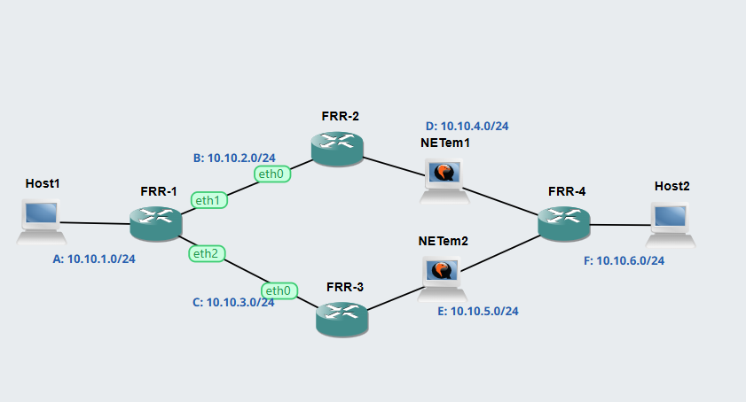
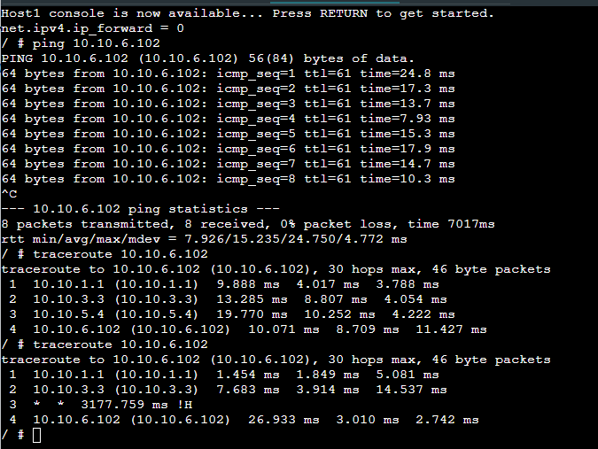
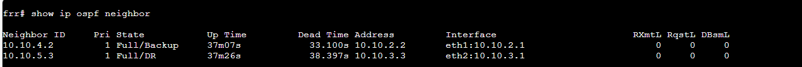
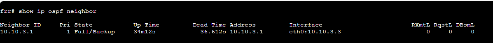

# Week 04: Routing
# Task 1: View Routing Tables  
1. GNS3 Project file      
[GNS3 File](View-Routes-12313676.gns3project)   

2. Network Diagram   

3. Record of IP Routes   
   

4. Ping to other network       
   

## Task 2: Dynamic Routing with OSPF

## Outputs

1. GNS3 File demonstrating OSPF    
[GNS3-File](OSPF-Basics-12313676.gns3project)   

2. Network Diagram demonstrating OSPF     
   

3. Neigbour routers of FRR1     
   

4. Routing table for two routers       
     
    

5. Routing Table Summary    

# Routing Summary Table (All Routers)

| Router | Destination Network | Next Node |
|--------|----------------------|-----------|
| **FRR‑1** | 10.10.1.0/24 | Direct (eth0) |
| FRR‑1 | 10.10.2.0/24 | Direct → FRR‑2 |
| FRR‑1 | 10.10.3.0/24 | Direct → FRR‑3 |
| FRR‑1 | 10.10.4.0/24 | FRR‑2 |
| FRR‑1 | 10.10.5.0/24 | FRR‑3 |
| FRR‑1 | 10.10.6.0/24 | FRR‑2 or FRR‑3 |    
     
| Router | Destination Network | Next Node |
|--------|----------------------|-----------|
| **FRR‑2** | 10.10.2.0/24 | Direct (eth0 → FRR‑1) |
| FRR‑2 | 10.10.4.0/24 | Direct (eth1 → NETem1) |
| FRR‑2 | 10.10.1.0/24 | FRR‑1 |
| FRR‑2 | 10.10.3.0/24 | FRR‑1 or FRR‑3 |
| FRR‑2 | 10.10.5.0/24 | FRR‑3 |
| FRR‑2 | 10.10.6.0/24 | FRR‑4 |
       
| Router | Destination Network | Next Node |
|--------|----------------------|-----------|
| **FRR‑3** | 10.10.3.0/24 | Direct (eth0 → FRR‑1) |
| FRR‑3 | 10.10.5.0/24 | Direct (eth1 → NETem2) |
| FRR‑3 | 10.10.1.0/24 | FRR‑1 |
| FRR‑3 | 10.10.2.0/24 | FRR‑1 or FRR‑2 |
| FRR‑3 | 10.10.4.0/24 | FRR‑2 |
| FRR‑3 | 10.10.6.0/24 | FRR‑4 |    
     
| Router | Destination Network | Next Node |
|--------|----------------------|-----------|
| **FRR‑4** | 10.10.6.0/24 | Direct (eth0) |
| FRR‑4 | 10.10.4.0/24 | FRR‑2 |
| FRR‑4 | 10.10.5.0/24 | FRR‑3 |
| FRR‑4 | 10.10.2.0/24 | FRR‑2 or FRR‑3 |
| FRR‑4 | 10.10.3.0/24 | FRR‑3 or FRR‑2 |
| FRR‑4 | 10.10.1.0/24 | FRR‑1 (via FRR‑2 or FRR‑3) |
     

