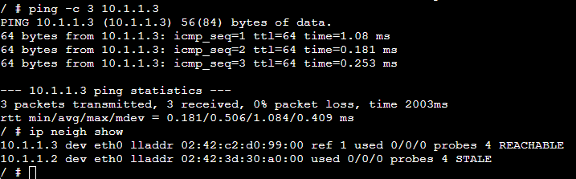
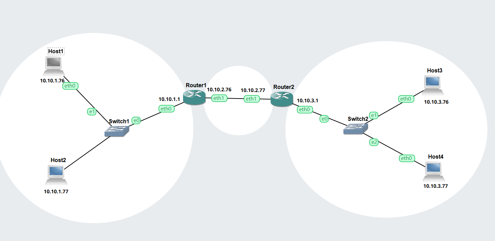
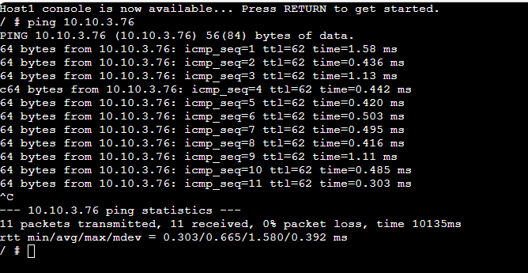

# Task 1: Resolving IP Addresses to Hardware Addresses

## SS OF ARP table of host A: 

 

# Task 2: Default Gateways

## Gns3 project: 

[GNS3 File](Gns3-files/Default-Gateway-12313676.gns3project) 

## Network Diagram: 

 

## Record of IP and routing tables:

## ss of successful ping:

 

